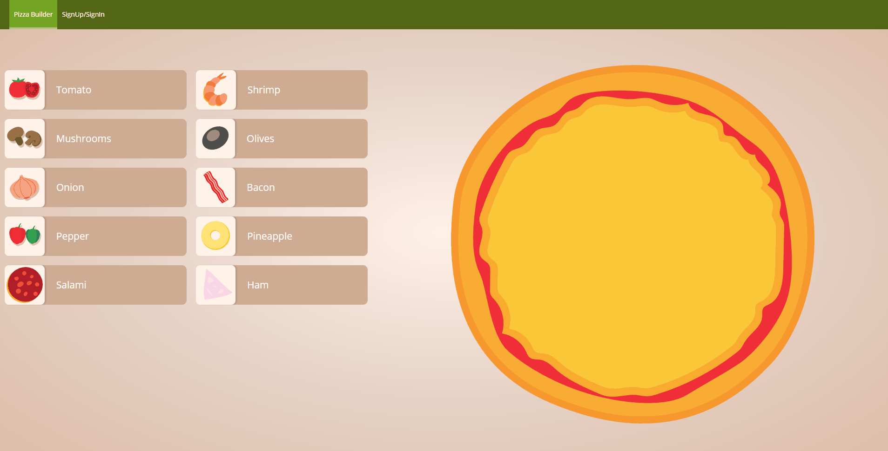

<h1>Pizza Builder </h1>

 
  

### Folders

`./` - CLIENT code and CRA dev server (React.js, AntDesign UI library)  
`./server` - SERVER code (NodeJS, Mongo)

### RUN CLIENT APP

In the directory run `./chat-app` install packages via `yarn` or `npm install`

`npm start` or `yarn start`

Runs the app in the development client mode.
Open [http://localhost:3000](http://localhost:3000) to view it in the browser.

The page will reload if you make edits.
You will also see any lint errors in the console.

### RUN API SERVER

`cd ./server` and `yarn` or `npm install` then `yarn start` or `npm start`

Launches the server.

## FEATURES DEMO

